# Custom Build Profile For Generating ModSkeleton Mods

ModSkeleton Mods build on top of Unreal Engine 4's DLC system. In order to cook and package a Mod, we're going to create two Custom Project Launcher Profiles. First, one to build the base game. Second, we're going to create a Profile for our DLC / Plugin / Mod, referencing the base game version.

## 1 - The Base Game

#### 1.1 - Open the Project Launcher

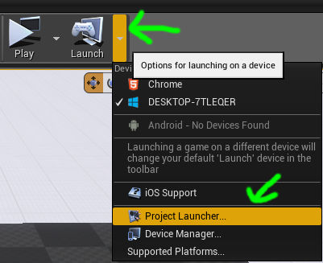

#### 1.2 - Create a New Custom Profile

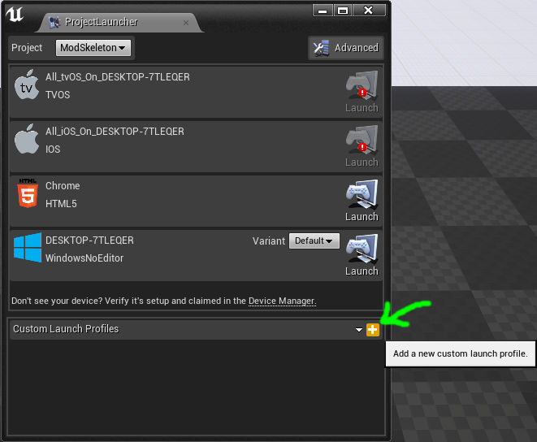

#### 1.3 - Give Your Profile A Name

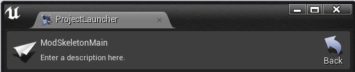

#### 1.4 - Tell the Profile to Build

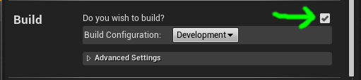

#### 1.5 - Tell it to Cook "By the Book"

- pick the platform you would like to cook for

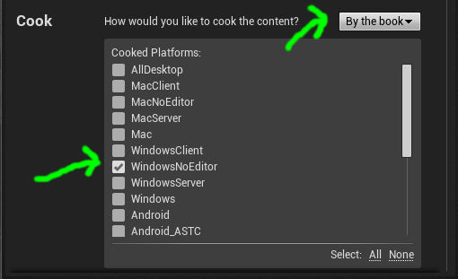

#### 1.6 - Cooking "Release" Settings

- Check "Create a release version of the game for distribution"
- Give a version name under "Name of the new release to create"

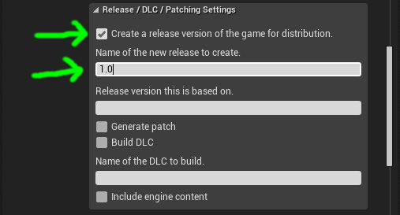

#### 1.7 - Cooking "Advanced" Settings

- Uncheck "Save packages without versions"
- Check "Store all contents in a single file (UnrealPak)"

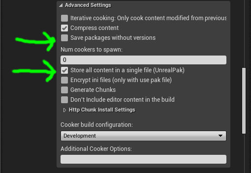

#### 1.8 - Package Locally

- Set to Package and Store Locally

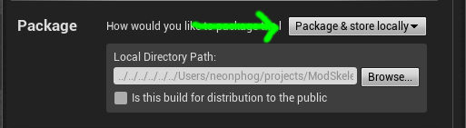

#### 1.9 - Do Not Deploy

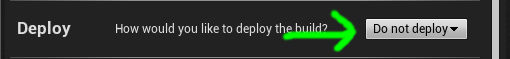

## 2 - The Mod (ModSkeletonExamplePluginA)

#### 2.1 - Open the Project Launcher

#### 2.2 - Create a New Custom Profile

#### 2.3 - Give Your Profile A Name

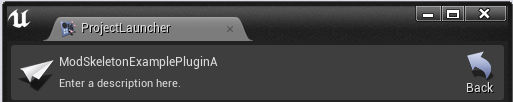

#### 2.4 - Tell the Profile to Build

#### 2.5 - Tell it to Cook "By the Book"

- pick the platform you would like to cook for

#### 2.6 - Cooking "Release" Settings

- Un-Check "Create a release version of the game for distribution"
- Leave "Name of the new release to create" blank
- Set "Release version this is based on." the same version string as in your base profile
- Check "Build DLC"
- Set "Name of the DLC to build." to "ModSkeletonExamplePluginA"

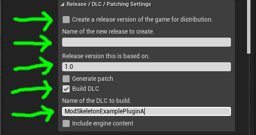

#### 2.7 - Cooking "Advanced" Settings

- Uncheck "Save packages without versions"
- Check "Store all contents in a single file (UnrealPak)"

#### 2.8 - Package Locally

- Set to Package and Store Locally

#### 2.9 - Do Not Deploy

